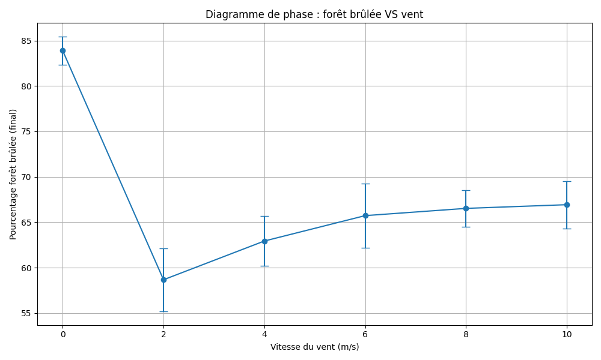

# FuncProg & CompPhy 2 - Final project
## Dynamics of Forest Fires
The Federal Office for the Environment wants to assess how climate
change may influence the frequency and severity of forest fires.
### Goal
The goal is to help the Federal Office for the Environment to simulate this event.
### Constraints
- Use `sbt` as a complete build tool.
- Use Scala (with `vars` if needed)
### Requirements to run
- `SBT` (Scala Build Tool)
- `Python` 3.12
# How to run
- Install `sbt` on the computer.

To check, if it is installed correctly, open the `terminal` and run.

```terminal
sbt --version
```
This should be the result, it might be different but has to be as a command.


```terminal
sbt runner version: 1.11.1
...
```
- Clone the repository
```bash
git clone https://github.com/fylis/funphy-actorbased-sim
```

- Go to the `funyphy-actorbases-sim` folder
```bash
cd funphy-actorbased-sim
```

- Run the code
```bash
sbt run
```

- Install `Python` requirements
```bash
cd funphy-actorbased-sim
pip install -r requirements.txt
```

- Run the `graph.py` script
```bash
python .\graph.py`
```
# Graph


# Video
For the simulation video, open the `res.mp4` file.