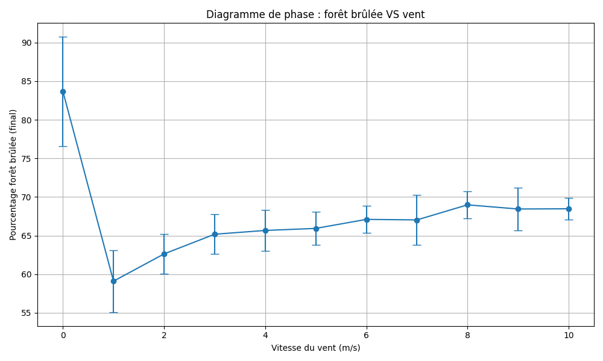

# FuncProg & CompPhy 2 - Final project
## Dynamics of Forest Fires
The Federal Office for the Environment aims to evaluate how climate change might impact the frequency and severity of forest fires.
This project provides a simulation tool to help analyze these effects.
## Goal
To simulate the dynamics of forest fires and assist the Federal Office for the Environment in assessing the influence of climate change.
## Constraints
- Use `sbt` as a complete build tool.
- Use Scala (with `vars` if needed)
## Requirements to run
- `SBT` (Scala Build Tool)
- `Python` 3.12
# How to run
- **Install `sbt` on the computer.**

To check, if it is installed correctly, open the `terminal` and run :

```terminal
sbt --version
```
You should see an output similar to :

```terminal
sbt runner version: 1.11.1
...
```
- **Clone the repository**
```bash
git clone https://github.com/fylis/funphy-actorbased-sim
```

- **Go to the `funyphy-actorbases-sim` folder**
```bash
cd funphy-actorbased-sim
```

⚠️ *For the best experience, maximize your terminal window to properly view all Forest Cells.*
- **Run the code**
```bash
sbt run
```

- **Install `Python` requirements**
```bash
cd funphy-actorbased-sim
pip install -r requirements.txt
```

- **Run the `graph.py` script**
```bash
python .\graph.py`
```
# Graph


# Video
To watch the simulation in action, open the `res.mp4` file.   